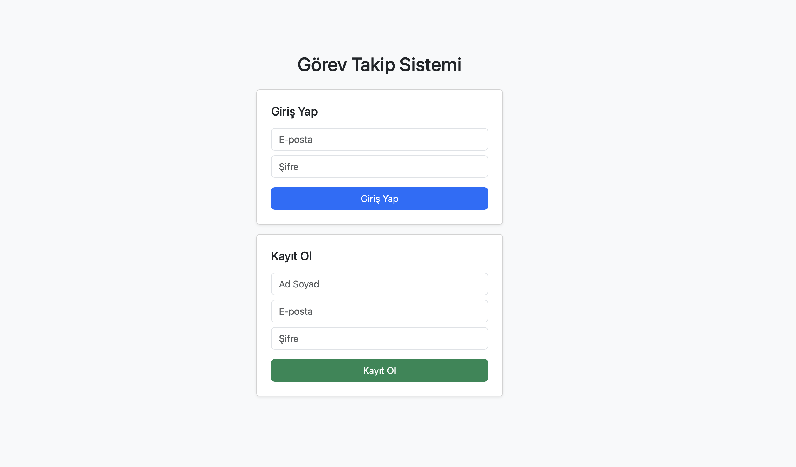
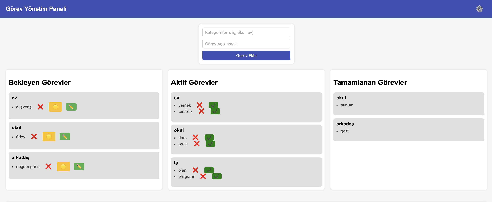
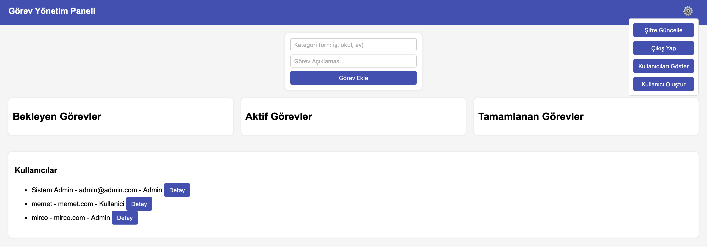

# TaskManagerApp

## Proje Açıklaması
TaskManagerApp, **ASP.NET Core Web API + HTML/CSS/JS frontend** ile geliştirilmiş bir görev yönetim sistemidir.  
Kullanıcılar:
- Görev oluşturabilir, silebilir, güncelleyebilir.
- Görevleri durumlarına göre (Bekleyen, Aktif, Tamamlanan) yönetebilir.
- Projeler altında görevlerini gruplar.
- Admin kullanıcılar diğer kullanıcıları görebilir, detay görüntüleyebilir ve kullanıcı ekleyip silebilir.

## Özellikler

- JWT tabanlı kimlik doğrulama ve yetkilendirme
- Görev ekleme, silme, güncelleme ve durum değiştirme (Bekliyor, Aktif, Tamamlandı)
- Proje bazlı görev gruplama
- Kullanıcı yönetimi (Admin kullanıcı yetkileri)
- Hata yönetimi için custom middleware
- Frontend (HTML/JS) ile tam etkileşimli arayüz

## Varsayılan Admin

- E-posta: admin@admin.com
- Şifre: 12345

## Kurulum

1. Projeyi klonlayın:
    ```bash
    git clone <repo-link>
    ```

2. Bağımlılıkları yükleyin:
    ```bash
    dotnet restore
    ```

3. Veritabanını oluşturun ve migrate edin:
    ```bash
    dotnet ef database update
    ```

4. Uygulamayı başlatın:
    ```bash
    dotnet run
    ```

## Kullanım

- Admin girişi yaparak kullanıcıları yönetebilirsiniz.
- Kullanıcılar kendi görevlerini yönetebilir.

## Güvenlik

- Tüm API çağrıları JWT token ile korunmaktadır.
- Admin rolü olmayan kullanıcılar yönetim yetkilerine erişemez.

# Task Manager App

## Giriş Sayfası


## Görev Paneli


## Kullanıcı Yönetimi

